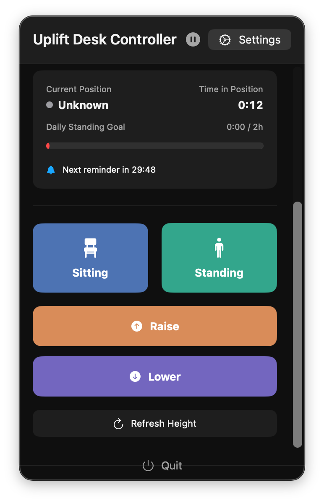
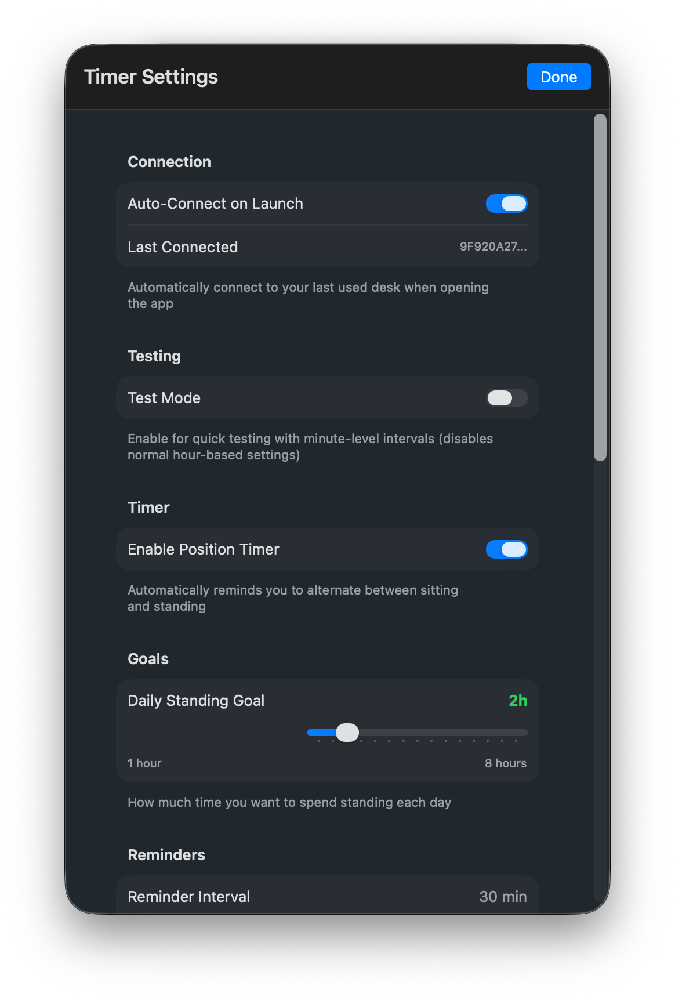
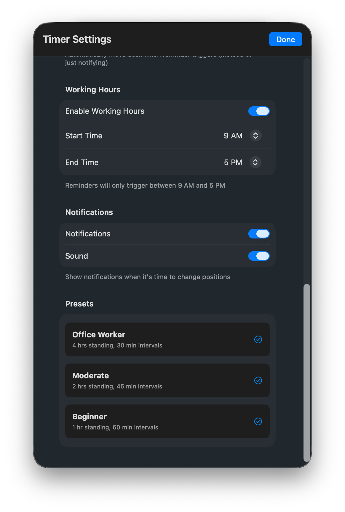

# Uplift Desk Controller

Control your Uplift standing desk from macOS with smart reminders to help you maintain a healthy sit-stand routine. Runs as a **menu bar app** — always one click away, no dock clutter.

  

## Screenshots

<table align="center"><tr>
  <td></td>
  <td></td>
  <td></td>
</tr></table>

## Features

- **Menu Bar App** - Lives in your macOS top bar, accessible anytime without a Dock icon
- **Desk Control** - One-tap presets for sitting/standing, manual raise/lower buttons
- **Real-time Height** - Displays current desk height in inches
- **Smart Reminders** - Configurable intervals to alternate between sitting and standing
- **Daily Standing Goal** - Track your progress toward a daily standing target
- **Working Hours** - Only receive reminders during your configured work schedule
- **Auto-Move** - Optionally move the desk automatically with a 5-second safety countdown
- **Pause Automation** - Quickly pause/resume automatic desk movement from the menu bar icon
- **Auto-Connect** - Reconnects to your last used desk on launch
- **Notification Support** - System notifications with optional sound when it's time to switch
- **Presets** - One-tap timer presets for Office Worker, Moderate, and Beginner routines
- **Quit from Menu** - Clean shutdown button built into the panel

## Quick Start

1. Open `uplift-desk-automated.xcodeproj` in Xcode
2. Build and run (⌘R)
3. Click the menu bar icon → **Connect to Desk**
4. Start controlling your desk!

## Setup

### Requirements
- macOS 13.0+
- Bluetooth-enabled Mac
- Uplift desk with Bluetooth

### First Time Use
1. Grant Bluetooth and Notification permissions when prompted
2. Click the menu bar icon and connect to your desk via the scanner
3. Configure reminders in Settings (⚙️ icon)

## Usage

### Basic Control
- **Sitting / Standing buttons** — Move desk to your saved preset height
- **Raise / Lower buttons** — Manual incremental adjustment
- **Refresh Height** — Re-read current desk height over Bluetooth

### Pause Automation
- Click the **pause button** (⏸) in the header to halt all automatic desk movements
- The menu bar icon changes to **⏸** so you can tell at a glance that automation is paused
- Click **play** (▶) to resume — the countdown picks up from where it left off

### Timer System
1. Open Settings → enable **Enable Position Timer**
2. Set your **Daily Standing Goal** (e.g. 4 hours)
3. Set **Reminder Interval** (e.g. every 30 minutes)
4. Optional: enable **Working Hours** (e.g. 9 AM – 5 PM)
5. Optional: enable **Auto-Move** for automatic desk adjustment with safety countdown

### Presets
| Preset | Daily Goal | Interval |
|--------|-----------|----------|
| Office Worker | 4 hours | 30 min |
| Moderate | 2 hours | 45 min |
| Beginner | 1 hour | 60 min |

## Troubleshooting

**Desk not found?**
- Check Bluetooth is enabled
- Ensure desk is powered on and nearby
- Use the scanner to search for nearby desks

**Connection fails?**
- Disconnect other devices from the desk
- Restart the app

**Reminders not working?**
- Check the timer is enabled in Settings
- Verify notification permissions in System Settings → Notifications
- Check your Working Hours configuration

**Auto-move not triggering?**
- Make sure Auto-Move is enabled in Settings
- Check that automation is not paused (menu bar icon should not show ⏸)

## Technical

### BLE Protocol
- Service UUID: `FE60`
- Control characteristic: `FE61` (write commands)
- Height characteristic: `FE62` (notify)

### Commands
| Action | Byte |
|--------|------|
| Wake | `0x00` |
| Raise | `0x01` |
| Lower | `0x02` |
| Sit preset | `0x05` |
| Stand preset | `0x06` |

## Project Structure

```
uplift-desk-automated/
├── ContentView.swift          # Main UI & menu bar panel
├── SettingsView.swift         # Settings sheet
├── BluetoothManager.swift     # BLE communication
├── DeskTimerManager.swift     # Timers, reminders & pause logic
├── TimerSettings.swift        # Settings model & persistence
└── UpliftDesk.swift           # Desk model
```

## License

MIT License

---

**Built with SwiftUI and CoreBluetooth**
